# Diagrama UML del Patrón Strategy

## Diagrama en PlantUML

```plantuml
@startuml Patrón Strategy - Asistente de Bebidas Starbucks

!define STRATEGY_COLOR #E1F5FE
!define CONCRETE_COLOR #F3E5F5
!define CONTEXT_COLOR #E8F5E8
!define SERVICE_COLOR #FFF3E0

package "Implementación del Patrón Strategy" {

    ' Estrategias de Búsqueda
    abstract class EstrategiaBusqueda <<interface>> STRATEGY_COLOR {
        + buscar(bebidas: List[Bebida], consulta: str): Optional[Bebida]
    }

    class EstrategiaCoincidenciaExacta CONCRETE_COLOR {
        + buscar(bebidas: List[Bebida], consulta: str): Optional[Bebida]
        - _normalizar_para_comparacion(texto: str): str
        - _quitar_acentos(texto: str): str
    }

    class EstrategiaSolapamientoTokens CONCRETE_COLOR {
        + buscar(bebidas: List[Bebida], consulta: str): Optional[Bebida]
        - _normalizar_para_comparacion(texto: str): str
        - _quitar_acentos(texto: str): str
    }

    class EstrategiaBusquedaDifusa CONCRETE_COLOR {
        - umbral: float
        + buscar(bebidas: List[Bebida], consulta: str): Optional[Bebida]
        - _normalizar_para_comparacion(texto: str): str
    }

    class EstrategiaBusquedaCompuesta CONCRETE_COLOR {
        - estrategias: List[EstrategiaBusqueda]
        + buscar(bebidas: List[Bebida], consulta: str): Optional[Bebida]
    }

    ' Estrategias de Precio
    abstract class EstrategiaEstimacionPrecio <<interface>> STRATEGY_COLOR {
        + estimar_precio(bebida: Bebida): float
    }

    class EstrategiaPrecioBasico CONCRETE_COLOR {
        + estimar_precio(bebida: Bebida): float
        - _inferir_tamaño_del_metodo(metodo: str): Optional[str]
    }

    class EstrategiaPrecioPorFamilia CONCRETE_COLOR {
        + estimar_precio(bebida: Bebida): float
        - _inferir_tamaño_del_metodo(metodo: str): Optional[str]
        - _inferir_familia_del_nombre(nombre: str): str
    }

    class EstrategiaPrecioPremium CONCRETE_COLOR {
        + estimar_precio(bebida: Bebida): float
    }

    class ContextoEstrategiaPrecio CONTEXT_COLOR {
        - _estrategia: EstrategiaEstimacionPrecio
        + establecer_estrategia(estrategia: EstrategiaEstimacionPrecio): void
        + estimar_precio(bebida: Bebida): float
    }

    ' Estrategias de Respuesta
    abstract class EstrategiaFormateoRespuesta <<interface>> STRATEGY_COLOR {
        + formatear_respuesta_encontrada(bebida: Bebida): str
        + formatear_respuesta_no_encontrada(consulta: str, sugerencias: List[Bebida]): str
    }

    class EstrategiaRespuestaEstandar CONCRETE_COLOR {
        + formatear_respuesta_encontrada(bebida: Bebida): str
        + formatear_respuesta_no_encontrada(consulta: str, sugerencias: List[Bebida]): str
        - _formatear_numero(valor: float): str
    }

    class EstrategiaRespuestaDetallada CONCRETE_COLOR {
        + formatear_respuesta_encontrada(bebida: Bebida): str
        + formatear_respuesta_no_encontrada(consulta: str, sugerencias: List[Bebida]): str
        - _formatear_numero(valor: float): str
    }

    class EstrategiaRespuestaCompacta CONCRETE_COLOR {
        + formatear_respuesta_encontrada(bebida: Bebida): str
        + formatear_respuesta_no_encontrada(consulta: str, sugerencias: List[Bebida]): str
        - _formatear_numero(valor: float): str
    }

    class ContextoFormateoRespuesta CONTEXT_COLOR {
        - _estrategia: EstrategiaFormateoRespuesta
        + establecer_estrategia(estrategia: EstrategiaFormateoRespuesta): void
        + formatear_respuesta_encontrada(bebida: Bebida): str
        + formatear_respuesta_no_encontrada(consulta: str, sugerencias: List[Bebida]): str
    }

    ' Estrategias de Sugerencia
    abstract class EstrategiaSugerencia <<interface>> STRATEGY_COLOR {
        + generar_sugerencias(bebidas: List[Bebida], consulta: str, max_sugerencias: int): List[Bebida]
    }

    class EstrategiaSugerenciaPorSimilitud CONCRETE_COLOR {
        + generar_sugerencias(bebidas: List[Bebida], consulta: str, max_sugerencias: int): List[Bebida]
        - _normalizar_para_comparacion(texto: str): str
        - _tokenizar(texto: str): List[str]
    }

    class EstrategiaSugerenciaPorCategoria CONCRETE_COLOR {
        + generar_sugerencias(bebidas: List[Bebida], consulta: str, max_sugerencias: int): List[Bebida]
    }

    class EstrategiaSugerenciaPorPopularidad CONCRETE_COLOR {
        + generar_sugerencias(bebidas: List[Bebida], consulta: str, max_sugerencias: int): List[Bebida]
    }

    class EstrategiaSugerenciaHibrida CONCRETE_COLOR {
        - estrategia_similitud: EstrategiaSugerenciaPorSimilitud
        - estrategia_categoria: EstrategiaSugerenciaPorCategoria
        - estrategia_popularidad: EstrategiaSugerenciaPorPopularidad
        + generar_sugerencias(bebidas: List[Bebida], consulta: str, max_sugerencias: int): List[Bebida]
    }

    class ContextoSugerencia CONTEXT_COLOR {
        - _estrategia: EstrategiaSugerencia
        + establecer_estrategia(estrategia: EstrategiaSugerencia): void
        + generar_sugerencias(bebidas: List[Bebida], consulta: str, max_sugerencias: int): List[Bebida]
    }

    ' Servicio Principal
    class ServicioBebidas SERVICE_COLOR {
        - ruta_csv: Path
        - bebidas: List[Bebida]
        - estrategia_busqueda: EstrategiaBusqueda
        - contexto_precio: ContextoEstrategiaPrecio
        - contexto_respuesta: ContextoFormateoRespuesta
        - contexto_sugerencia: ContextoSugerencia
        + establecer_estrategia_busqueda(estrategia: EstrategiaBusqueda): void
        + establecer_estrategia_precio(estrategia: EstrategiaEstimacionPrecio): void
        + establecer_estrategia_respuesta(estrategia: EstrategiaFormateoRespuesta): void
        + establecer_estrategia_sugerencia(estrategia: EstrategiaSugerencia): void
        + buscar_bebida(consulta: str): Optional[Bebida]
        + obtener_sugerencias(consulta: str, max_sugerencias: int): List[Bebida]
        + formatear_respuesta_encontrada(bebida: Bebida): str
        + formatear_respuesta_no_encontrada(consulta: str, sugerencias: List[Bebida]): str
        + cargar_bebidas(): void
    }

    ' Modelo
    class Bebida {
        + nombre: str
        + metodo_preparacion: str
        + calorias: Optional[float]
        + grasa_total: Optional[float]
        + categoria: Optional[str]
        + precio: Optional[float]
        + url_imagen: Optional[str]
        + descripcion: Optional[str]
    }
}

' Relaciones
EstrategiaBusqueda <|-- EstrategiaCoincidenciaExacta
EstrategiaBusqueda <|-- EstrategiaSolapamientoTokens
EstrategiaBusqueda <|-- EstrategiaBusquedaDifusa
EstrategiaBusqueda <|-- EstrategiaBusquedaCompuesta

EstrategiaEstimacionPrecio <|-- EstrategiaPrecioBasico
EstrategiaEstimacionPrecio <|-- EstrategiaPrecioPorFamilia
EstrategiaEstimacionPrecio <|-- EstrategiaPrecioPremium

EstrategiaFormateoRespuesta <|-- EstrategiaRespuestaEstandar
EstrategiaFormateoRespuesta <|-- EstrategiaRespuestaDetallada
EstrategiaFormateoRespuesta <|-- EstrategiaRespuestaCompacta

EstrategiaSugerencia <|-- EstrategiaSugerenciaPorSimilitud
EstrategiaSugerencia <|-- EstrategiaSugerenciaPorCategoria
EstrategiaSugerencia <|-- EstrategiaSugerenciaPorPopularidad
EstrategiaSugerencia <|-- EstrategiaSugerenciaHibrida

ContextoEstrategiaPrecio o-- EstrategiaEstimacionPrecio
ContextoFormateoRespuesta o-- EstrategiaFormateoRespuesta
ContextoSugerencia o-- EstrategiaSugerencia

ServicioBebidas o-- EstrategiaBusqueda
ServicioBebidas o-- ContextoEstrategiaPrecio
ServicioBebidas o-- ContextoFormateoRespuesta
ServicioBebidas o-- ContextoSugerencia
ServicioBebidas --> Bebida

EstrategiaBusquedaCompuesta o-- EstrategiaBusqueda
EstrategiaSugerenciaHibrida o-- EstrategiaSugerenciaPorSimilitud
EstrategiaSugerenciaHibrida o-- EstrategiaSugerenciaPorCategoria
EstrategiaSugerenciaHibrida o-- EstrategiaSugerenciaPorPopularidad

@enduml
```

## Explicación del Diagrama

### Componentes Principales

1. **Interfaces de Estrategia**: Definen los contratos para cada tipo de estrategia
2. **Implementaciones Concretas**: Diferentes algoritmos para cada estrategia
3. **Contextos**: Clases que encapsulan y gestionan las estrategias
4. **ServicioBebidas**: Servicio principal que coordina todas las estrategias
5. **Bebida**: Modelo de datos

### Flujo de Ejecución

1. **Configuración**: `ServicioBebidas` se inicializa con estrategias por defecto
2. **Cambio Dinámico**: Las estrategias pueden cambiarse en tiempo de ejecución usando los métodos `establecer_*_estrategia()`
3. **Ejecución**: Cuando se llama a un método del servicio, este delega a la estrategia correspondiente
4. **Composición**: Algunas estrategias (como `EstrategiaBusquedaCompuesta`) combinan múltiples estrategias

### Beneficios del Diseño

- **Flexibilidad**: Intercambio dinámico de algoritmos
- **Extensibilidad**: Fácil adición de nuevas estrategias
- **Mantenibilidad**: Separación clara de responsabilidades
- **Testabilidad**: Cada estrategia es testeable independientemente
